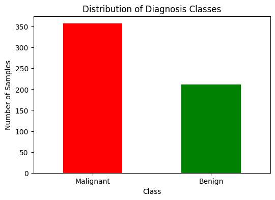
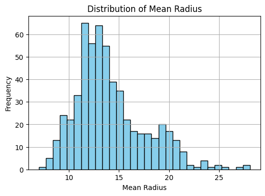
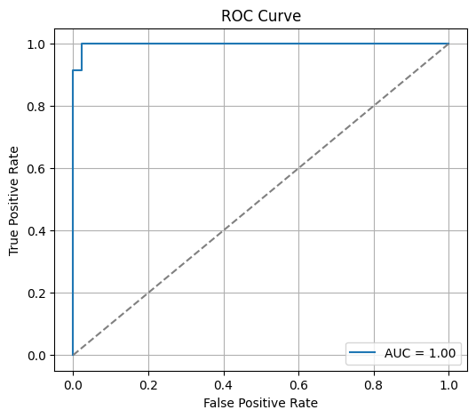

# breast-cancer-classifier
Breast cancer classification using logistic regression implemented from scratch with gradient descent on the Wisconsin dataset. Includes data exploration, model training, evaluation (ROC, AUC), and custom predictions.

# 🩺 Breast Cancer Classification using Logistic Regression (from Scratch)

This project demonstrates a **binary classification model** to detect whether a tumor is **Malignant (cancerous)** or **Benign (non-cancerous)** using the popular **Breast Cancer Wisconsin dataset**.  
The logistic regression model is implemented **from scratch using Gradient Descent** (without relying on `sklearn`’s LogisticRegression).

---

## 📊 Dataset
- Source: [Scikit-learn’s built-in dataset](https://scikit-learn.org/stable/modules/generated/sklearn.datasets.load_breast_cancer.html)  
- Features: 30 real-valued input features (e.g., mean radius, mean texture, smoothness, symmetry, etc.)  
- Classes:  
  - **0 → Malignant**  
  - **1 → Benign**  
- Samples: 569 total

---

## ⚙️ Methodology
1. **Data Exploration**
   - Visualized class distribution (Malignant vs Benign)  
   - Plotted feature distribution (`mean radius`)  

2. **Preprocessing**
   - Train-test split (80:20)  
   - Standardized features using `StandardScaler`  
   - Added bias (intercept) term manually  

3. **Model Implementation**
   - Logistic Regression implemented from scratch
   - Sigmoid activation function
   - Cross-entropy loss function
   - Gradient Descent optimizer  

4. **Evaluation**
   - Train/Test accuracy  
   - ROC Curve + AUC score  
   - Predictions on custom input samples  

---

## 🚀 Results
- **Train Accuracy**: ~99%  
- **Test Accuracy**: ~97%  
- **AUC Score**: ~0.99  

---

## 📷 Demo

### Class Distribution


### Feature Distribution (Mean Radius)


### ROC Curve


---

## 💡 Use Cases
- Early detection of breast cancer (decision-support tool for doctors).  
- Educational example for understanding **logistic regression from scratch**.  
- Benchmark project for comparing ML models on structured datasets.  

---

## 🛠️ How to Run
### 1. Clone Repository
```bash
git clone https://github.com/your-username/breast-cancer-classification.git
cd breast-cancer-classification
